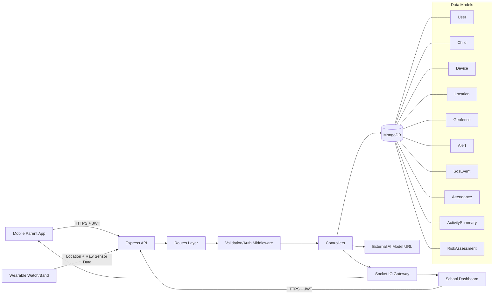
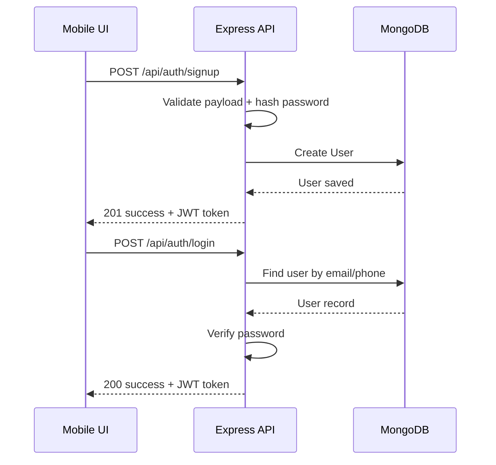
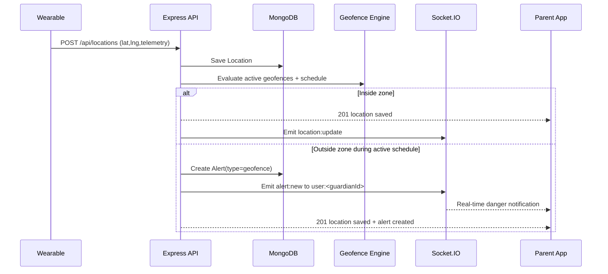
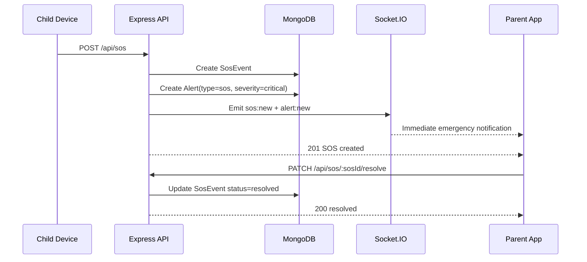
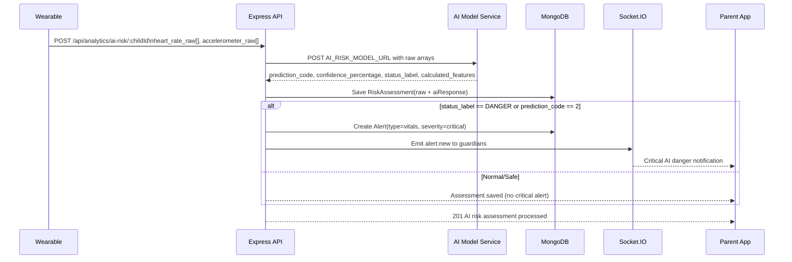
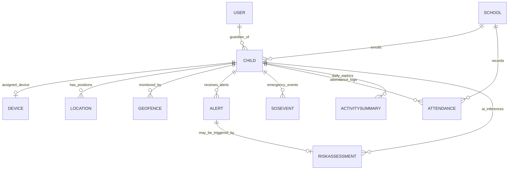
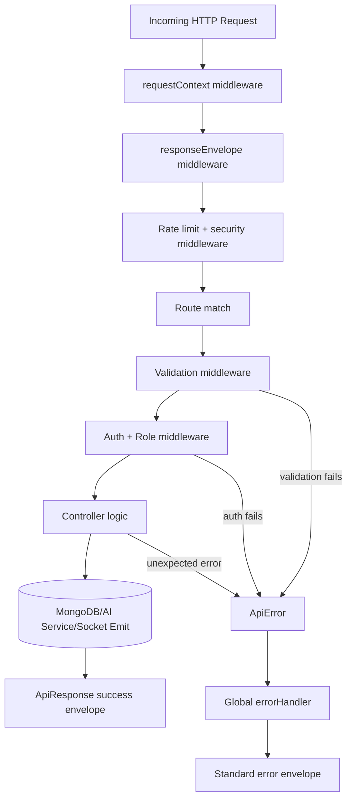

# SWIRI — Full System Workflow & Entity Journey

## 1) System Purpose

SWIRI is a proactive child-safety backend that combines:
- Real-time location tracking
- SOS emergency handling
- Geofence and schedule-based alerts
- Attendance tracking for schools
- Activity summaries and behavior analytics
- AI risk detection from wearable raw sensor streams

The backend exposes REST APIs, Socket.IO events, and persistent MongoDB storage.

---

## 2) High-Level Architecture

### Core Layers
1. **Routes Layer**
   - Receives HTTP requests
   - Validates request schema
   - Applies auth/role middleware
   - Passes execution to controllers

2. **Controller Layer**
   - Implements domain logic
   - Reads/writes data via Mongoose models
   - Calls AI service integrations
   - Emits socket notifications when required

3. **Service Layer**
   - External integrations (AI model URL)
   - Isolates third-party call logic from controllers

4. **Data Layer (MongoDB + Mongoose)**
   - Stores users, children, devices, locations, alerts, attendance, activity summaries, SOS events, and AI risk assessments

5. **Realtime Layer (Socket.IO)**
   - Authenticated socket sessions
   - Room-based notifications (`user:<id>`, `child:<id>`, `school:<id>`)

6. **Cross-Cutting Middleware**
   - Request context (`x-request-id`)
   - Validation
   - Authentication and role guards
   - Standardized success/error envelopes

---

## 3) Main Entities and Their Roles

## 3.1 User
Represents all account types:
- `parent`
- `school`
- `staff`
- `admin`
- `driver`

Key responsibilities:
- Authenticates into system
- Can be linked to one school
- Parents are linked to one or many children

## 3.2 School
- Stores school metadata and geolocation
- Manages attendance/safety context during school hours

## 3.3 Child
- Core protected entity
- Linked to guardians (`User`), school, and optionally one wearable device

## 3.4 Device
- Wearable tracker/watch/band
- Bound to a child
- Feeds telemetry and location

## 3.5 Location
- Time-stamped geolocation points per child/device
- Drives live tracking and geofence checks

## 3.6 Geofence
- Circular safe zone + schedule (days/time)
- Used to trigger out-of-zone alerts only during configured windows

## 3.7 Alert
- Unified alert model (`geofence`, `sos`, `vitals`, etc.)
- Sent to guardians/school users and can be consumed in real-time

## 3.8 ActivitySummary
- Daily aggregate metrics (steps, active/rest minutes, heart rate stats)
- Used for trend-based insights

## 3.9 SosEvent
- Emergency incident opened by child/device/automation
- Can be resolved later

## 3.10 Attendance
- School check-in/check-out records
- Sources: `nfc`, `ble`, or `manual`

## 3.11 RiskAssessment
- Stores wearable raw arrays + AI inference result
- Optionally linked to triggered critical alert

---

## 4) End-to-End Journeys

## 4.1 Authentication Journey (Parent/School/Staff)
1. Client signs up (`/api/auth/signup`)
2. Backend validates payload (email/phone/password/terms)
3. Password is hashed and user is stored
4. JWT token returned in standard success envelope
5. Client uses token in `Authorization: Bearer <token>` for protected APIs

Login supports identifier by email or phone.

---

## 4.2 Parent Onboarding Journey
1. Parent creates child (`/api/children`)
2. Device is registered and assigned (`/api/devices`, `/api/devices/:id/assign`)
3. Parent configures geofence (`/api/geofences`)
4. Location ingestion starts (`/api/locations`)
5. Parent receives real-time events through socket rooms

---

## 4.3 School Operational Journey
1. School account creates school profile (`/api/schools`)
2. Students are associated with school
3. Attendance events are recorded (`/api/attendance`)
4. School dashboard fetches attendance list and safety events
5. Access is controlled by role and policy boundaries

---

## 4.4 Real-Time Location + Geofence Journey
1. Watch/device sends location payload
2. Backend stores location record
3. Backend checks active geofences for child
4. If child exits configured zone during valid schedule:
   - Creates geofence alert
   - Emits `alert:new` to guardians/child room
5. Client dashboard reflects live map + alerting

---

## 4.5 SOS Journey
1. Child/device triggers SOS (`/api/sos`)
2. Backend creates `SosEvent`
3. Backend creates critical `Alert`
4. Socket emits `sos:new` and `alert:new` to guardians/child
5. Authorized user resolves event (`/api/sos/:sosId/resolve`)

---

## 4.6 AI Risk Detection Journey (Raw Watch Data)

### Input from watch (raw arrays)
```json
{
  "heart_rate_raw": [80, 82, 90, 135, 145],
  "accelerometer_raw": [1.1, 1.2, 3.5, 4.0, 3.8]
}
```

### Backend flow
1. Client posts to `/api/analytics/ai-risk/:childId`
2. Backend validates payload
3. Backend calls external AI model URL (`AI_RISK_MODEL_URL`)
4. Backend receives AI response:
```json
{
  "prediction_code": 2,
  "confidence_percentage": 98.5,
  "status_label": "DANGER",
  "calculated_features": {
    "hr_mean": 106.4,
    "hr_gradient": 65.0,
    "acc_mean": 2.72,
    "acc_variance": 1.58
  }
}
```
5. Backend stores complete inference in `RiskAssessment`
6. If danger condition (`prediction_code = 2` or `status_label = DANGER`):
   - Create critical `vitals` alert
   - Emit socket notifications to guardians
7. History can be fetched via `GET /api/analytics/ai-risk/:childId`

---

## 4.7 Activity & Behavior Insight Journey
1. System/app stores daily summary (`/api/activities`)
2. Analytics endpoint (`/api/analytics/behavior/:childId`) compares recent day vs baseline
3. Returns flags (e.g., low activity, heart-rate spike)
4. Dashboard uses this for awareness and proactive follow-up

---

## 5) API Response Contract

## 5.1 Success Envelope
```json
{
  "success": true,
  "statusCode": 200,
  "message": "Request successful",
  "data": {},
  "meta": null,
  "requestId": "uuid",
  "timestamp": "2026-02-15T10:00:00.000Z"
}
```

## 5.2 Error Envelope
```json
{
  "success": false,
  "statusCode": 400,
  "error": {
    "code": "VALIDATION_ERROR",
    "message": "Validation failed",
    "details": []
  },
  "requestId": "uuid",
  "timestamp": "2026-02-15T10:00:00.000Z"
}
```

This ensures clients can reliably parse every response.

---

## 6) Realtime Event Contract

Common server-emitted events:
- `location:update`
- `alert:new`
- `sos:new`

Room strategy:
- `user:<userId>` for personal notifications
- `child:<childId>` for child-centric streams
- `school:<schoolId>` for school-scoped streams

---

## 7) Security and Reliability Principles

- JWT-based authentication for protected routes
- Role guard for authorization (`parent`, `school`, `admin`, etc.)
- Joi validation at route level
- Centralized error normalization and formatting
- Request correlation via `x-request-id`
- Rate limiting and secure headers (`helmet`)

---

## 8) Full Entity Interaction Map (Summary)

1. **User** authenticates
2. **Parent** creates **Child**
3. **Device** assigned to **Child**
4. **Location** stream updates child position
5. **Geofence** rules evaluate location and may generate **Alert**
6. **SosEvent** generates critical **Alert** and realtime notifications
7. **Attendance** records school entry/exit
8. **ActivitySummary** stores periodic health/activity data
9. **RiskAssessment** stores AI decisions from raw watch arrays
10. **Alert** acts as unified output for urgent action

---

## 9) Suggested Next Iteration

- Add multi-tenant data partitioning per school
- Add event/audit log for every critical state transition
- Add retry/timeout/circuit-breaker around AI service calls
- Add push notification channels (FCM/APNs/SMS)
- Add RBAC policy matrix document per endpoint

---

## 10) Operational Checklist

- Configure `.env` values (`MONGO_URI`, `JWT_SECRET`, `AI_RISK_MODEL_URL`)
- Keep AI API key secret (`AI_RISK_MODEL_API_KEY`)
- Monitor request IDs in logs for incident tracing
- Use Postman collections for integration testing

This document reflects the complete implemented journey up to the current state of the SWIRI backend.

---

## 11) Visual Diagrams (Actual Runtime Flow)

> These Mermaid diagrams can be rendered directly in GitHub/Markdown viewers that support Mermaid.

### 11.1 System Architecture Diagram



### 11.2 Authentication Flow (Normal Path)



### 11.3 Real-Time Location + Geofence Flow (Normal/Alert Path)



### 11.4 SOS Emergency Flow



### 11.5 AI Risk Detection Flow (Raw Arrays -> Model -> Save -> Alert)



### 11.6 Entity Relationship Diagram (Operational)



### 11.7 Request Lifecycle in Backend


